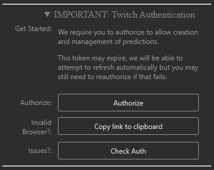

# Prediction Buttons Plus

Prediction Buttons Plus (or PDP) is a new premium Elgato Stream Deck plugin, building on the features on the original Prediction Buttons, rebuilt from the ground up and including new features that could only be done after the rebuild.

## Features

- Setup Repeatable Twitch Chat Predictions
- Control active predictions
- **NEW** Read outcomes from text files directly to Twitch.
- Supported Hardware: Stream Deck, Stream Deck Mini, Stream Deck XL, Stream Deck Neo, Stream Deck +

## Where to get it

Elgato Marketplace - [Marketplace Link]()

## Getting Started

To use the plugin, you need to authorise the plugin on Twitch. To do so, follow the steps in the **Twitch Authentication** section.

The Authorise button will ask you to log in to Twitch, then once complete, will show you a button to click which will reopen the Stream Deck software and complete the auth process.

## How it works

### Quick Start

1. Add a 'Start Prediction' / 'Start File Prediction' action.
2. Press the action on hardware.
3. You may be prompted to install a profile, this will be necessary if you have "Swap to Profile" enabled in the settings.
4. Control the prediction from the Actions or Profile provided.

## Profiles

This is the profile for the 15 button Stream Deck, however all of these provided profiles include:
- A back action (returns you to the previous Stream Deck screen)
- A Cancel Prediction action (Cancels the prediction and refunds the poinsts used)
- a Lock Prediction action (toggles the Lock state of the Prediction)
- 10 Confirm action actions (these are dynamically filled with your settings or active prediction values)

> **Please do not edit these profiles**: Functionality can be broken if you mess with these profiles, if you have done this, just delete the profile and when you relaunch as prediction it will recreate it!

## Mod Controlled Predictions **EXPERIMENTAL**

A frequent ask is allowing Mods to control the predictions. Currently there is no programatic way of doing this but there is a workaround with the new plugin.

1. As the streamer, load the backup auth flow into a browser

2. Complete the auth flow as usual
3. On the final page, instead of left clicking the button, right click and press the "Copy Link Address" button. This will add a URL starting with **streamdeck://...**

4. Share this with the trusted user to control the predictions from this Stream Deck. and open it on a browser, this will then authorise that stream deck with the details needed. (It should open the Stream Deck software, or bring it to the forefront)

**NOTE:** This may interrupt control of the plugin on the original Stream Deck, in testing all devices could still control the predictions however further testing and refinement needs to be done. I cannot guarantee this will work flawlessly as it was not designed for this purpose.

## Support

> If you enjoyed what I've made and want to support me further, check out my [ko-fi page](https://ko-fi.com/ghostlytuna) and pledge some support! It all keeps the lights on. 

If you have any more questions or need more support, check out the [discord](https://discord.gg/S67P7UH).