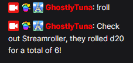

# Connecting to StreamerBot

This is a step by step guide to get your streamroll overlays connected to streamerbot. 

## 1. Get signed up at Streamroll.io.

You should already have a login if you got this far, but if you haven't.

# [StreamRoll.io](https://streamroll.io)

## 2. Import the example actions into your Streamerbot instance.

You can find the StreamerBot section on the tools tab once you have logged in!

> **GetRolledValue** handles getting the value from the overlay into SB.

> **SendBasicRoll** Sends a set roll to the overlay.

> **SendTwitchRoll** Similar to SendBasicRoll but has already setup components to get the event that triggers this action (channel points, chat command etc) and add that into a basic roll. 

**SendConfigRoll** Supports the new system of configs, specify a config name to trigger.

**SendTwitchConfigRoll** Similar to SendConfigRoll however has the extra Twitch connectivity setup.

## 3. Ensure the websocket server is turned on in SB.

**Ensure it is the correct websocket server, selecting the wrong will mean this actions cannot operate.**

It is currently under the tab "Websocket Server", please ignore the other websocket related tabs.

## 4. Add websocket server details and confirm them to complete connection.

You will need to add the listener action **GetRolledValue** to the setup here.

## 5. Add UUID to the global variables of Streamerbot.

The StreamerBot Global variables means it can be set once and works across all the actions.

//TODO change image to reflect

Remember to make sure it is spelt "StreamTimer UUID"!

## 6. All setup, trigger away!

This is tied to a chat command called *!roll*, triggers the action and then outputs it with **SendRolledValue**.

Same roll command, but with SendTwitchRoll

> Reminder: If you enjoyed what I've made and want to support me in return, check out my [ko-fi page](https://ko-fi.com/ghostlytuna) and pledge some support! It all keeps the lights on. 

If you have any more questions or need more support, check out the [discord](https://discord.gg/S67P7UH).